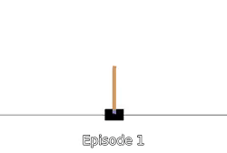
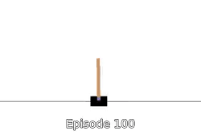

# Policy gradient algorithms on OpenAI's Cartpole

## Summary
&nbsp;&nbsp;&nbsp;&nbsp;The goal of this application is to implement Policy Gradient algorithms on Open AI Cartpole enviroment. Algorithms that were implemented include: 
  * [REINFORCE](https://github.com/leonjovanovic/deep-reinforcement-learning-pg-cartpole/tree/main/reinforce)[[paper]](https://link.springer.com/article/10.1007/BF00992696)
  * [Actor-Critic (AC)](https://github.com/leonjovanovic/deep-reinforcement-learning-pg-cartpole/tree/main/actor-critic%20(AC))[[paper]](https://ieeexplore.ieee.org/abstract/document/6313077)
  * [Synchronized Advantage Actor Critic (A2C)](https://github.com/leonjovanovic/deep-reinforcement-learning-pg-cartpole/tree/main/A2C)[[paper]](https://github.com/openai/baselines/blob/master/baselines/a2c/a2c.py)
  * [Asynchronized Advantage Actor Critic (A3C)](https://github.com/leonjovanovic/deep-reinforcement-learning-pg-cartpole/tree/main/A3C)[[paper]](https://arxiv.org/pdf/1602.01783.pdf)

&nbsp;&nbsp;&nbsp;&nbsp;Results show difference in efficiency between REINFORCE and Actor-Critic algorithm as well as between A2C and A3C algorithms. Algorithms were compared based on whether algorithm uses multiprocessing or not. As it can be seen on the graph below, Actor-Critic achieves considerable improvement in efficiency over REINFORCE, while A3C shows some improvement comparing to A2C.
  
 



*Actor-Critic: Episode 1 vs Episode 50 vs Episode 100*

## Environment
&nbsp;&nbsp;&nbsp;&nbsp;Cartpole is OpenAI Classic control enviroment which corresponds to the version of the cart-pole problem described by [Barto, Sutton, and Anderson](https://ieeexplore.ieee.org/abstract/document/6313077). [Cartpole enviroment](https://gym.openai.com/envs/CartPole-v1/) contains a cart and a pole and the cart is only movable object in this enviroment. The pole is attached by an un-actuated joint to a cart, which moves along a frictionless track. The system is controlled by applying a force of +1 or -1 to the cart. The pendulum starts upright, and the goal is to prevent it from falling over. 


&nbsp;&nbsp;&nbsp;&nbsp;State (input for neural network) is described with Cart Position, Cart Velocity, Pole Angle and Pole Angular Velocity (Box(4)). Reward is +1 for every step taken, including the termination step. There are two possible actions, Push cart to the left and Push cart to the right which will be output of our neural network.

&nbsp;&nbsp;&nbsp;&nbsp;The episode ends when the pole is more than 15 degrees from vertical, the cart moves more than 2.4 units from the center or episode length is greater than 500.

## Policy Gradient
&nbsp;&nbsp;&nbsp;&nbsp; Describe general idea behind Policy Gradient.

## Structure
&nbsp;&nbsp;&nbsp;&nbsp; Describe structre of NNs used in this project

## REINFORCE algorithm
&nbsp;&nbsp;&nbsp;&nbsp; Describe REINFORCE

## Actor-Critic algorithm
&nbsp;&nbsp;&nbsp;&nbsp; Describe AC

## Synchronized Advantage Actor-Critic (A2C)
&nbsp;&nbsp;&nbsp;&nbsp; Describe A2C

## Asynchronized Advantage Actor-Critic (A3C)
&nbsp;&nbsp;&nbsp;&nbsp; Describe A3C

## Results

    
## Rest of the data and TensorBoard
&nbsp;&nbsp;&nbsp;&nbsp;Rest of the training data can be found at [/content/runs](https://github.com/leonjovanovic/deep-reinforcement-learning-atari-pong/tree/main/content/runs). If you wish to see it and compare it with the rest, I recommend using TensorBoard. After installation simply change the directory where the data is stored, use the following command
  
```python
LOG_DIR = "full\path\to\data"
tensorboard --logdir=LOG_DIR --host=127.0.0.1
```
and open http://localhost:6006 in your browser.
For information about installation and further questions visit [TensorBoard github](https://github.com/tensorflow/tensorboard/blob/master/README.md)

## Future improvements
  


