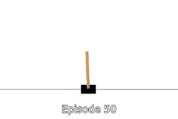
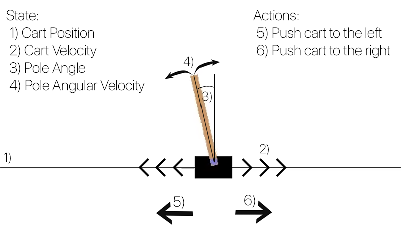
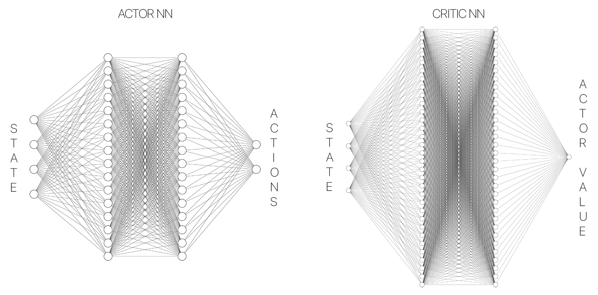
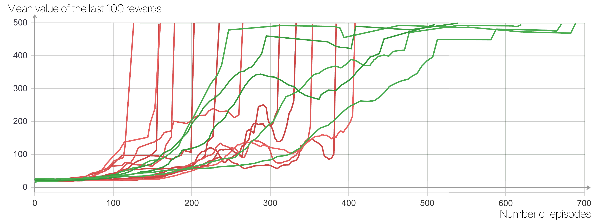
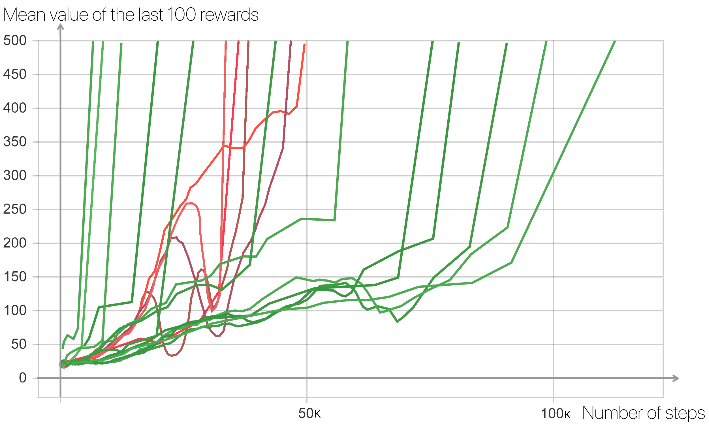

# Policy gradient algorithms on OpenAI's Cartpole

## Summary
&nbsp;&nbsp;&nbsp;&nbsp;The goal of this application is to implement Policy Gradient algorithms on [Open AI Cartpole enviroment](https://gym.openai.com/envs/CartPole-v1/). Algorithms that were implemented include: 
  * [REINFORCE](https://github.com/leonjovanovic/deep-reinforcement-learning-pg-cartpole/tree/main/reinforce) \[[paper](https://link.springer.com/article/10.1007/BF00992696)\]
  * [Actor-Critic (AC)](https://github.com/leonjovanovic/deep-reinforcement-learning-pg-cartpole/tree/main/actor-critic%20(AC)) \[[paper](https://ieeexplore.ieee.org/abstract/document/6313077)\]
  * [Synchronized Advantage Actor Critic (A2C)](https://github.com/leonjovanovic/deep-reinforcement-learning-pg-cartpole/tree/main/A2C) \[[paper](https://github.com/openai/baselines/blob/master/baselines/a2c/a2c.py)\]
  * [Asynchronized Advantage Actor Critic (A3C)](https://github.com/leonjovanovic/deep-reinforcement-learning-pg-cartpole/tree/main/A3C) \[[paper](https://arxiv.org/pdf/1602.01783.pdf)\]

&nbsp;&nbsp;&nbsp;&nbsp;Results show difference in efficiency between REINFORCE and Actor-Critic algorithm as well as between A2C and A3C algorithms. Algorithms were compared based on whether algorithm uses multiprocessing or not. As it can be seen on the [graph below](https://github.com/leonjovanovic/deep-reinforcement-learning-pg-cartpole/blob/main/README.md#results), Actor-Critic achieves considerable improvement in efficiency over REINFORCE, while A3C shows some improvement comparing to A2C.
  
 



*Actor-Critic: Episode 1 vs Episode 50 vs Episode 100*

## Environment
&nbsp;&nbsp;&nbsp;&nbsp;[Cartpole](https://gym.openai.com/envs/CartPole-v1/) is OpenAI Classic control enviroment which corresponds to the version of the cart-pole problem described by [Barto, Sutton, and Anderson](https://ieeexplore.ieee.org/abstract/document/6313077). Cartpole enviroment contains a cart and a pole and the cart is only movable object in this enviroment. The pole is attached by an un-actuated joint to a cart, which moves along a frictionless track. The system is controlled by applying a force of +1 or -1 to the cart. The pendulum starts upright, and the goal is to prevent it from falling over. 



*Cartpole Enviroment*

&nbsp;&nbsp;&nbsp;&nbsp;State is described with Cart Position, Cart Velocity, Pole Angle and Pole Angular Velocity. Reward is +1 for every step taken, including the termination step. There are two possible actions, Push cart to the left and Push cart to the right which will be output of our neural network.

---
&nbsp;&nbsp;&nbsp;&nbsp;The episode ends when the pole is **more than 15 degrees from vertical**, the cart moves **more than 2.4 units from the center** or episode length is **greater than 500**. Goal is reached when algorithm achieves **mean score of 495 or higher on last 100 episodes (games)**.

## Policy Gradient
&nbsp;&nbsp;&nbsp;&nbsp; Policy gradient methods are a type of reinforcement learning techniques that rely upon optimizing parametrized policies with respect to the expected return (long-term cumulative reward) by gradient descent. The policy is parametrized with neural network where input is 4x1 vector that represents current state and output is 2x1 vector with probabilities of each action. In case of Actor-Critic and its variants, two different neural networks were used, one for Actor (which is same as the policy network described previously) and Critic neural network which represents value function whose role is to estimate how good of a choise was an action chosen by Actor (policy). 



*Actor-Critic Neural Network structure*

## REINFORCE algorithm
&nbsp;&nbsp;&nbsp;&nbsp;REINFORCE (Monte-Carlo policy gradient) relies on an estimated return by Monte-Carlo methods using episode samples to update the policy network parameters. Its Monte-Carlo method because it relies on full trajectories. A widely used variation of REINFORCE is to subtract a baseline value from the return Gt to reduce the variance of gradient estimation while keeping the bias unchanged (Remember we always want to do this when possible). In this version we used mean discounted reward as baseline.

## Actor-Critic algorithm
&nbsp;&nbsp;&nbsp;&nbsp; Actor-Critic algorithm expandes REINFORCE where in addition to the policy (Actor) algorithm implements value function (Critic) which will resolve wether the action Actor took was good one or not. Unlike REINFORCE agent does not wait for entire episode to finish to update policy and value function but do it after N steps using TD learning (estimated discounted rewards). Each step represents one time-step in which agent needs to decide wether to go left or right. To improve the exploration of the agent, entropy regularization was implemented.

&nbsp;&nbsp;&nbsp;&nbsp; Since there is no clear line between Actor-Critic algorithm and A2C, this Actor-Critic algorithm was implemented with Advantage function (baseline) while syncronization was left for A2C. Critic's value function was used as advantage.

## Synchronized Advantage Actor-Critic (A2C)
&nbsp;&nbsp;&nbsp;&nbsp; Synchronized Advantage Actor-Critic (A2C) was first introduced as one of OpenAI's baselines which is basically Actor-Critic algorithm with multiple workers (processes). Workers collect N steps transitions, after which they are blocked in queue. When all workers finish collecting, main process use those informations to update both Actor and Critic NN parameters. At the end main unblocks all train processes waiting in queue. Multiprocessesing is done by [PyTorch multiprocessing library](https://pytorch.org/docs/stable/multiprocessing.html). 

&nbsp;&nbsp;&nbsp;&nbsp; Each train process needs to send N transitions (current & new state, actions, rewards and entropies) and communication is done by queues. Sending Object type variable throughout queues would trigger [multiprocessing.Queue](https://docs.python.org/3/library/multiprocessing.html) to cause Memory leak. Because of that, multiple queues were implemented for each type of information (current & new state, actions...).

## Asynchronized Advantage Actor-Critic (A3C)
&nbsp;&nbsp;&nbsp;&nbsp; Asynchronized Advantage Actor-Critic (A3C) algorithm was used from paper [Mnih et al.](https://arxiv.org/pdf/1602.01783.pdf). It introduces version of Actor-Critic algorithm where each worker (train process) works independently while sharing two global neural networks (Actor & Critic). At the start of each iteration worker saves local copy of policy and value function, collects N step transitions, calculates loss and updates global Actor and Critic NNs.

## Testing
&nbsp;&nbsp;&nbsp;&nbsp; To get accurate results, each algorithm has additional worker (test process) whose job is to occasionally test 10 episodes and calculate mean reward of last 10 episodes. By the rules, if test process gets 495 or higher mean score over last 100 games, goal is reached and we should terminate. 

&nbsp;&nbsp;&nbsp;&nbsp; Since testing and training work in parallel and testing 100 games can take some time, if we try to plot test results, graph will have small amount of data because test process didn't have time to test it multiple times before train processes reached goal. Because of that number of episodes were lowered to 10, which led to testing being quicker and much better results graph. If mean reward of last 10 episodes (current NN parameters) is => 495, then we will test for 90 more. If mean reward of last 100 episodes is lower than 495 we start again and if it is equal or higher we reached goal and we terminate. When we reach the goal test process changes value of shared variable *end_flag* which will signal train processes to terminate as well.

## Results

&nbsp;&nbsp;&nbsp;&nbsp; Its not really fair to compare single and multi process algorithms, so results are separated in REINFORCE vs Actor-Critic and A2C vs A3C. Comparing A2C and A3C is not absolutely accurate as they have to have exact same resources during runs which was to certain degree achieved. 

### REINFORCE vs Actor-Critic
&nbsp;&nbsp;&nbsp;&nbsp; Results can be seen on graph below, where X axis represents number of episodes (games) finished and Y axis represents mean reward of last 100 episodes.



-  `REINFORCE algorithm`
-  `Actor-Critic algorithm`

&nbsp;&nbsp;&nbsp;&nbsp; As it can be seen Actor-Critic algorithm reached goal much more quickly than REINFORCE with almost 400 episode difference between their best results. It also shows that AC is much more stable as some REINFORCE runs achieve score of over 475 after 250/300 episodes but fails to be stable enough to get higher mean reward until 200 episodes later.

* Best mean reward in last 100 games
    * **REINFORCE: after 126 games**
    * **Actor-Critic: after 510 games**

---
### A2C vs A3C
&nbsp;&nbsp;&nbsp;&nbsp; Results can be seen on graph below, where X axis represents number of steps (time-steps) finished and Y axis represents mean reward of last 100 episodes. We can't measure comparing results to episodes like in comparison above because in A3C each process is on different episode. They have different episodes because of different start time and different episode lenght. We can only estimate episode by taking maximum episode count of all processes.



-  `Synchronized Advantage Actor-Critic (A2C)`
-  `Asynchronized Advantage Actor-Critic (A3C)`

&nbsp;&nbsp;&nbsp;&nbsp; Graph shows that in average both algorithms perform similary but A3C performes much better in few cases. If we look only at stable results, A3C slightly outperformes A2C.

* Best mean reward in last 100 games
    * **A2C: after 33.6k steps - 45 games**
    * **A3C: after 6.6k steps** 

## Rest of the data and TensorBoard
&nbsp;&nbsp;&nbsp;&nbsp;Rest of the training data can be found at [/results](https://github.com/leonjovanovic/deep-reinforcement-learning-atari-pong/tree/main/results). If you wish to see it and compare it with the rest, I recommend using TensorBoard. After installation simply change the directory where the data is stored, use the following command
  
```python
LOG_DIR = "full\path\to\data"
tensorboard --logdir=LOG_DIR --host=127.0.0.1
```
and open http://localhost:6006 in your browser.
For information about installation and further questions visit [TensorBoard github](https://github.com/tensorflow/tensorboard/blob/master/README.md)
  


